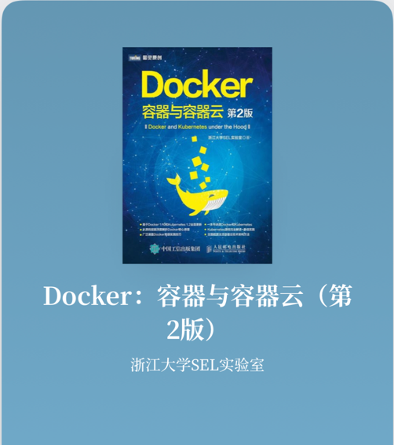
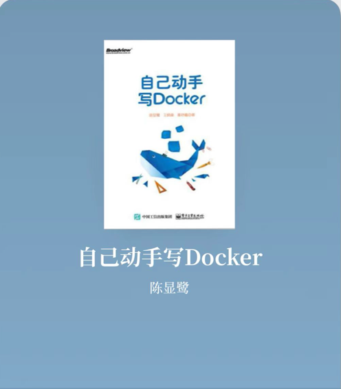

# MyDocker
DIY Docker，Just For Fun.

Thanks for the following two books:




# How To Play
## Build 
* This project is developed on MacOS, with golang version `go1.17.1 darwin/amd64`. 
* This project contains **cgo** code. 

### Build on MacOS
Take MacOS for example:

* First, install `x86_64-linux-musl-gcc`
```
arch -x86_64 brew install FiloSottile/musl-cross/musl-cross
```
* build with the following command:
```shell
CC=x86_64-linux-musl-gcc CGO_ENABLED=1 GOOS=linux GOARCH=amd64  go build -ldflags "-linkmode external -extldflags -static" -o my-docker main.go
```

#### Remote Debug
In order to debug my-docker in linux os env:

1. Install go on ubuntu linux
2. Install delve
```shell
go install github.com/go-delve/delve/cmd/dlv@latest
```
3. Compile with dlv:
```shell
CC=x86_64-linux-musl-gcc CGO_ENABLED=1 GOOS=linux GOARCH=amd64  go build -ldflags "-linkmode external -extldflags -static" -gcflags "all=-N -l" -o my-docker-dlv main.go

```
4. Start dlv on ubuntu
```shell
dlv --listen=:2345 --headless=true --api-version=2 --accept-multiclient exec ./my-docker-dlv [command] -- [-option of my-docker]
```
5. Use Go Remote in IDEA to start remote debug

## Play
### Environment
```
Linux ubuntu-linux 4.4.0-142-generic #168~14.04.1-Ubuntu SMP Sat Jan 19 11:26:28 UTC 2019 x86_64 x86_64 x86_64 GNU/Linux
```

### Setup

* make sure **cgroup** is mounted
* play with **root** user
* for network:
```shell
echo 1 > /proc/sys/net/ipv4/ip_forward
```
* uzip `my-docker.tar` in `/root`
* play with `my-docker` after `chmod`

### Commands
```shell
USAGE:
   my-docker [global options] command [command options] [arguments...]

COMMANDS:
   exec     exec a command into container
   init     Init container process run user's process in container. Do not call it outside
   ps       list all containers
   logs     print logs of a container
   rm       remove unused container
   run      create a container: my-docker run -ti [command]
   stop     stop a container
   network  container network commands
   commit   commit a container to image
   image    image commands
   help, h  Shows a list of commands or help for one command

GLOBAL OPTIONS:
   --help, -h  show help
```
#### run command
```shell
USAGE:
   my-docker run [command options] [arguments...]

OPTIONS:
   --ti              enable tty
   -d                detach container
   --mem value       memory limit
   --cpushare value  cpushare limit
   --cpuset value    cpuset limit
   --name value      container name
   -e value          set environment
   --net value       container network
   -p value          port mapping
```
#### image command
```shell
USAGE:
   my-docker image command [command options] [arguments...]

COMMANDS:
   ls  list images

OPTIONS:
   --help, -h  show help
```

#### network command
```shell
USAGE:
   my-docker network command [command options] [arguments...]

COMMANDS:
   create  create a container network
   ls      list container network
   rm      remove container network

OPTIONS:
   --help, -h  show help
```

### Images
* not support `push/pull` command with repositories
* only support make new image with `commit` command
* two built-in images:
```shell
REPOSITORY   TAG         IMAGE ID
busybox      1.0.0       7bad98125db6
busybox      test        01ca9b37f1c4
```
The `busybox:1.0.0` provides a simplified linux environment。
